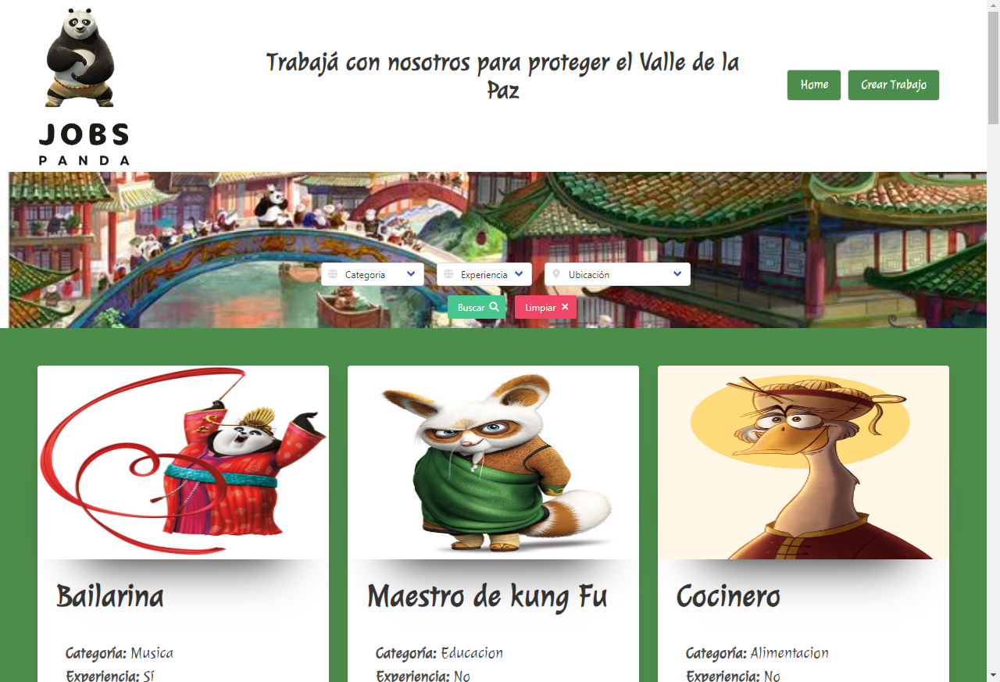
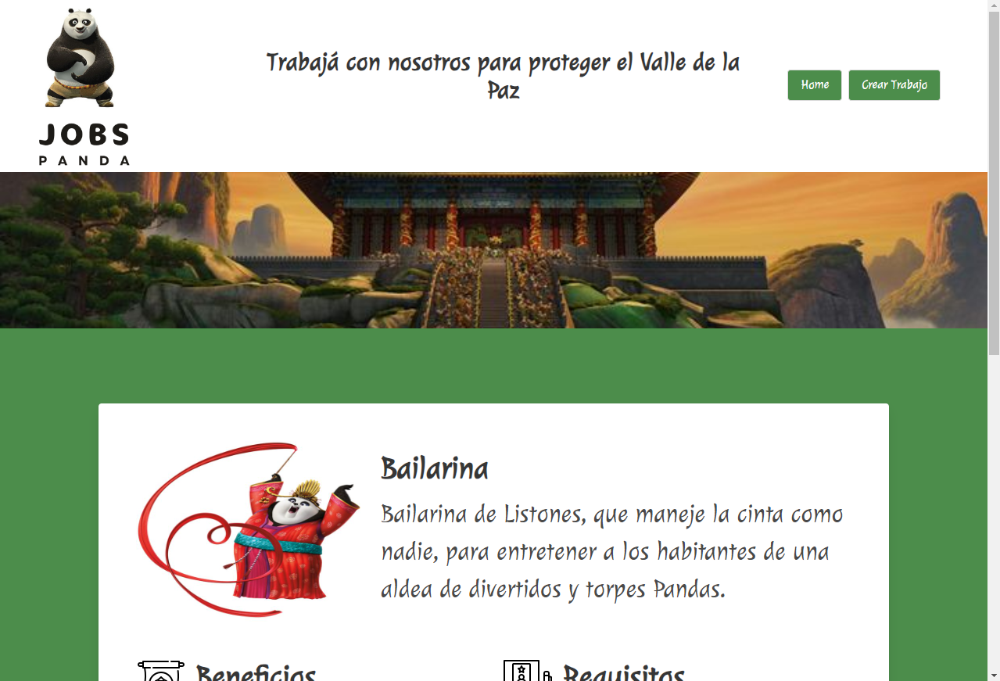
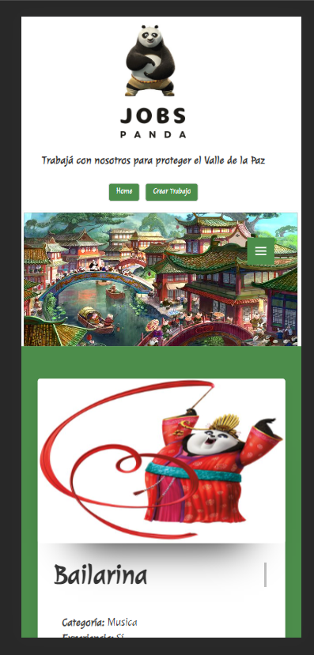

# Josbs-Panda
***
## _Descripción_
 Trabajo final del modulo 4 de Js de la carrera Desarrollo Front-end, en ADA ITW.
***
## _Funciones de la app_
Es una app para ver ofertas de trabajo en la cual tambien se puede:
* Editar empleos ya cargados.
* Agregar empleos nuevos.
* Se puede filtrar tenes tres diferentes opciones, pero solo podes usar una a la vez.
* Tambien de ser necesario podes eliminar alguna oferta de trabajo.
***
## _Herramientas utilizadas_
* HTML5
* CSS
* Bulma
* JS - API
* Git 
* GitHub
***
## _Para ver más_
Este el link de la app, podes hacer click aca o copiar y pegar en tu navegador preferido.
Esta app es totalmente adaptativa y responsive.
<a href="https://regal-donut-fcffe7.netlify.app/" target="_blank">Click Aquí</a>
***
**Vista incial**

**Vista de ver mas info**

**Vista para celular**

## _Contacto_
Acá mis Redes Sociales, si queres contactarme:
* <a href="http://wa.me/541134277653">Whatsapp</a>
* <a href="http://github.com/betsynohe">Github</a>
* <a href="http://www.linkedin.com/in/betsy-guitian-b36b06242/">Linkedin</a>
* <a href="mailto:betsyguitian@gmail.com">E-mail</a>